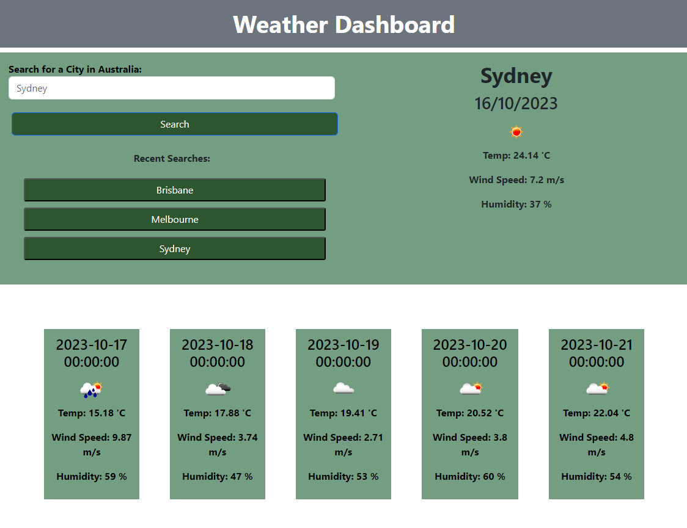

# Weather Dashboard

## Description

Third-party APIs allow developers to access their data and functionality by making requests with specific parameters to a URL. This weather dashboard has been build to assist its user with displaying the current weather and the 5-days-forecast for the Australian cities that they have searched for. The Open Weather API has been used to retrieve weather data for the Australian cities. This app will run in the browser, and will feature dynamically updated HTML and CSS powered by JavaScript code. It will have a clean, polished, and responsive user interface. 

## Installation

N/A

## Usage

To use the Weather Dashboard Application, you can copy and paste this link into your browser: https://miloyang.github.io/Weather-App

The page should open as per below screenshots:

The HTML, CSS and Javascript code can be seen when you open the Chrome DevTools by pressing Command+Option+I (macOS) or Control+Shift+I (Windows). A console panel should open either below or to the side of the webpage in the browser. Head into the Elements, Styles, Sources and Application tab, and there you will see the codes, along with the inputs that are stored in the local storage.

When you enter an Australian city anc click on the Search button, you will be presented with the current weather and the 5-days-forecast of that city.

When you view the current weather, you will be presented with the city name, the current date, an icon representation of weather conditions, the temperature, the wind speed and the humidity of that city. 

When you view the 5-days-forecast, you will be able to see the weather conditions for the 5 days ahead of that city. 

When you have searched for a few cities, you will be able to see that your previously searched cities are showing in the Recent Searches section. 

When you click on one of the recent searches, you will be taken to the current weather and the 5-days-forecst of that city again. 

The page will have a responsive layout that adapts the viewport, when you resize the page or view the site on various screens and devices.

## Credits

Coding Bootcamp by USYD x EDX

## License

Please refer to the LICENSE in the repo.
